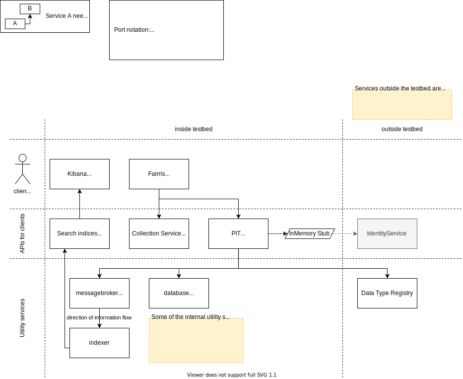
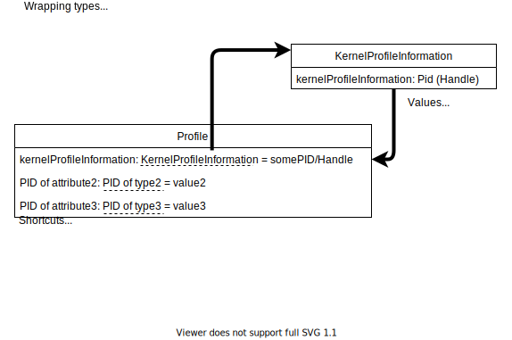
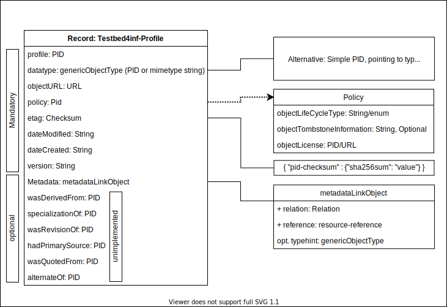

# Testbed4inf - a FAIR Digital Object testbed

For installation, general usage, updating and the repository structure, please take a look into the readme file at the root of this repository. This documentation aims to document the most important service communication workflows etc.

## A place to begin with

> **While the architecture of the testbed will likely not change very often, experimentational services like Fairris will. As it is in an early stage and often modified for experimentation, it might change, add or remove features with time. Feel free to use Fairris as an entry point (see below), but the actual thing in here is the testbed itself.**

> **Important: Fairris is a way to implement the APIs of this testbed in a way it is likely too annoying for end users. It is meant for experimentation and exploration, not as a guide how to do it in production software!**

Fairris is a simple web interface for this testbed, available at http://localhost:8080/ after starting the testbed using `docker-compose up`. It allows to manually apply the steps that a client implementation would do as automated as possible:

- Manage PID records and associate them with data (limited and rapidly changing functionality as this is just a demo UI)
    - Some collection API support (limited)
    - PIT Service support (register records)
- Viewing FDOs
    - Any FDO registered using Fairris is visible within the application. The content of the records can be displayed.
    - Note: Fairris is for demonstrational / experimantal purposes only. A page reload will reset Fairris, as it is a simple frontend without any backend (local storage is currently not used or planned). Reset means here to forget all "associated data" and all records (even the registered ones). Of course, the collection API still contains the collections, and the PID-Service still contains all records.

## Detailed topics

- [Creating FDO for an annotated image (example use case)](pageannotation.md)
    - Keywords: Aristoteles A04, PageAnnotation, XML, existing data
- [Search functionality / indexing records in this testbed](search.md)
    - Keywords: messaging, federation, search, indexing, Elasticsearch, Kibana
- [Collections in the testbed](collection.md)
    - Keywords: collection api, Fairris

# Configuration

You can find the configuration files of the services within this repository. They are usually used when building the images or creating the containers. Some services are directly provided as a docker image, so note that they may use their default configurations.

Some important notes about the current state of configuration:

- PIT-Service
    - By default, no real FDOs get created, but are stored in memory to allow a trial-and-error-usage of the testbed. In this case, you can view both the PIT service API and the in-memory-storage extensions API from the swagger web interface, which is accessible depending on your configuration i.e. under the following link: http://localhost:8090/swagger-ui.html
    - To switch to a real PID-Service (not to be confused by a PIT-Service) instead of the in-memory-storage, you need to remove the `pit.pidsystem.inmemory.baseURI` property from the configuration.
- Fairris
    - If you do not yet find a configuration file in this testbed (which is currently the case, 11.12.2020), Fairris is not yet configurable. This will change soon, but before that, any changes in the docker-compose file may break Fairris functionality. This is something you should not be afraid of, as Fairris is not a vital part of the testbed.

## Data Type Registry and Profiles

The Data Type Registry is not included in the testbed, instead an external DTR is used. It includes data types **and** profiles. This is an overview of how it works, in case you want or need to. This is only important when defining profiles! In case you want to know how to register a PID record, simply use the PIT Service API. Also, the following is strongly implementation specific to the used data type registry. Still, it is something I want to keep documented as these are some of the core principles which need to be understood when defining new profiles.

Every attribute name of the profile is in practice represented by a pid, not a (normal) string. The attibute names here are just for readability. A pid is a unique string. An attributes pid has a type (which has also its own PID). The type defines the values allowed for an attribute. According to the [PID KernelInformation Recommendations][recommendations], a value should be indivisible, similar to primitive types in programming languages. This is illustrated in the following figure:

A profile defines mandatory and optional attributes. Some attributes are allowed to occur multiple times. In practice this means that the value may be some kind of array, depending of the used technologies (i.e. a JSON array). The following figure shows the currently used profile, which is an extension of the recommended kernel information profile. Things will change rapidly in the profiles section in 2021.

[recommendations]: https://www.doi.org/10.15497/A5BCD108-ECC4-41BE-91A7-20112FF77458
