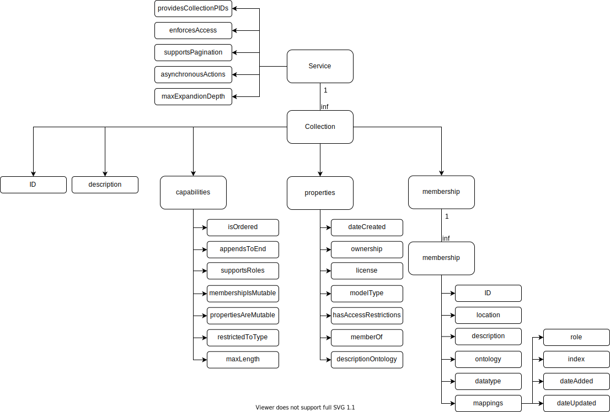

# Collections in the testbed

As a general overview, this an overview of the aspects the collection API offers.

There is free access to this API via the testbed. If you use Fairris, the ID of the collection is currently not a PID, but an ID generated by the API. A collection may then be "wrapped" into a record. Note that Fairris will likely never support every collection API feature available, as this is not of importance here.

## Mapping PID records to collections

This is not done yet. There will likely be an extra profile ([Draft](http://dtr-test.pidconsortium.net/#objects/21.T11148/5d5df5eeb962155aa8ba)).