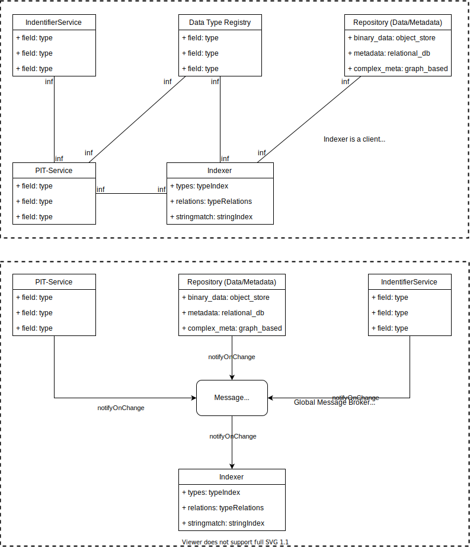

# Searching PID records

## Status: proof of concept

Indexing and searching is generally possible, but more in a "proof-of-concept" kind of state. The indexer, which is the part being not much more than a proof-of-concept, is currently improved for another use case, and the next version within the testbed will likely build on this new version.

The PIT-Service will send out a message on record changes, and the indexer will be notified, transform the record for elasticsearch and ingest it. You can search the index directly via the elastic APIs or using the Kibana web interface.

## Notes

Currently, the transformation of the PID Record to some elastic search compatible representation has a bug which affects strings which can be converted to integers or floats. As the used handlebars java implementation looses any information of the type of a value, Strings containing valid floats will be inserted as numbers. What does this mean in practice? Assume you ingested a record containing a field `"version"` with the value `"1.0.0"`, which will be indexed. In this case, elasticsearch will accept this value and assume, that version is always of type string. Another record may contain the key-value-pair `"version": "1"`. `"1"` will then be ingested as integer `1`, which will be refused by elasticsearch, as the type of the field was recognized as a string on the first ingest. To work around this issue, avoid values inside of strings, that can be converted into an integer or float.

This problem will be fixed in future versions by finding out a different way for generic JSON transformation. If you have any recommendation for a technology wich may solve this, feel free to open an issue.

## Planning documents:

